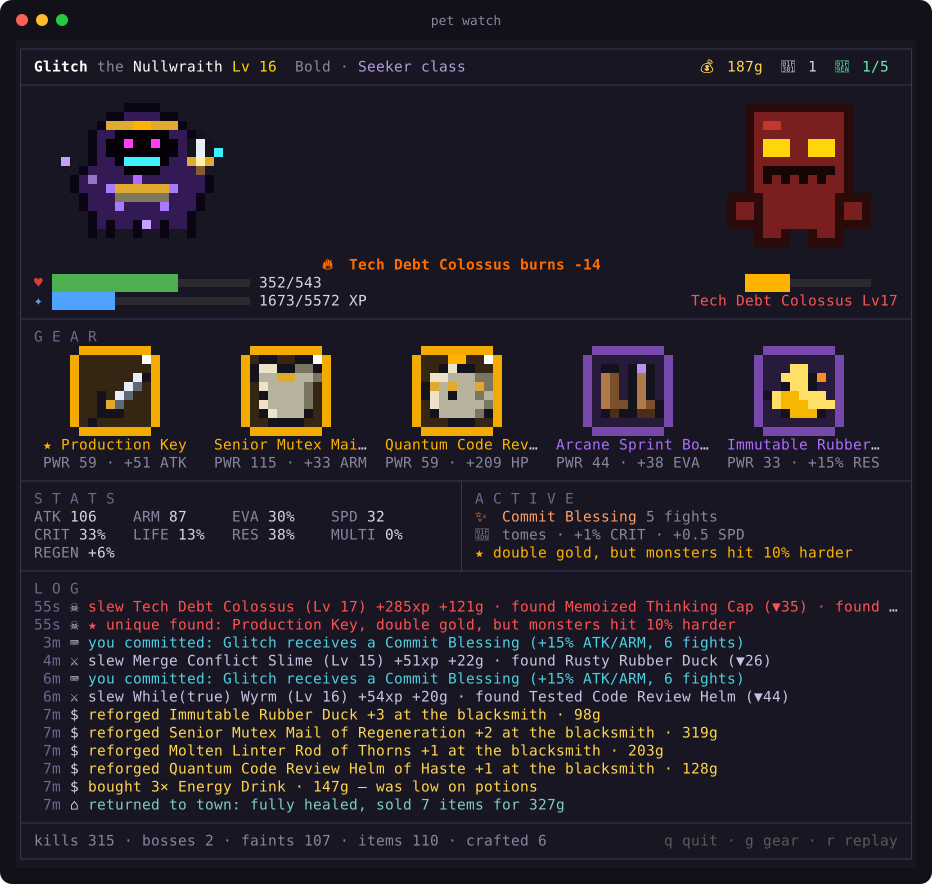

# idlemon

An idle RPG pet that lives in [Claude Code](https://claude.com/claude-code). While you code, monsters spawn, and your pet fights them, loots gear, shops, crafts and evolves. You never press a button; it plays itself.



*The watch view, captured from a real save mid-boss-fight.*


*Top: the egg, the Fire, Lightning and Void starter lines, and the 1% Demon King with its Abyssal Scythe. Bottom: all 11 regular monsters, the loot crate and the crafting anvil. Rendered from the game's own sprite code. One more is out there, at 1 in 1000.*

📖 **[Wiki](docs/WIKI.md):** every item, monster, drop rate, nature, shiny and formula, generated from the code.

## Install

idlemon is a Claude Code [mod](https://code.claude.com/docs/en/plugins/mods/overview), so it needs Claude Code v2.1.287 or later (`claude --version`). In a session:

```
/plugin install idlemon --marketplace byQuexo/claude-pet
```

Or from your shell: `claude plugin marketplace add byQuexo/claude-pet`, then `claude plugin install idlemon@idlemon`. Your egg appears after Claude's next tool call.

Coming from claude-pet? Your save and display settings move over by themselves the first time idlemon loads. Then remove the old hooks and statusline wrapper with `node <your clone>/pet.js uninstall`, or every tool call counts twice (idlemon reminds you until you do).

## Watching it

- **Above the prompt:** the pet and its card sit in the band above the prompt and animate once a second. Three modes (`/idlemon mode`):
  - `full`: the sprite plus a card with level, HP, XP, ATK/ARM/EVA, all 5 gear slots, gold, potions and buffs
  - `minimal`: only the pet, at the far right
  - `compact`: two lines of text
- **`/idlemon`:** opens the watch pane, beside the transcript in a wide fullscreen terminal or above the prompt otherwise. It works while Claude is busy.
  - **Arena:** replays every fight blow by blow: lunges, element-coloured slashes, crit shake, monsters dissolving when they die. It also shows crate openings, the crafting anvil and evolutions. Between fights the arena stays clear, with the last result and the town countdown.
  - **Gear:** a tile for each slot in its rarity colour (legendaries sparkle), with name, power score and top stat.
  - **Stats and active:** your stats on one side; buffs, tomes, set progress, unique effects and badges on the other.
  - **Log:** repeats collapse (`you committed ×3`) and purchases group.
  - **Keys:** `1` watch · `2` gear · `3` seed · `r` replay the last fight · `g` show or hide gear on the pet · `Esc` close.
- **Desktop app:** the band and the pane draw as pictures in the Code tab. The VS Code chat panel and `claude -p` run the game but draw nothing.

## How it plays

- **Ticks:** every tool call Claude makes is a tick. Monsters spawn on about 15% of ticks, and more often when a tool call fails.
- **Your starter is seeded by how you code:** while it's an egg (Lv 1–5), the pet records your tool mix, the hours you code, which file types you edit, how many repos you work in (hashed, never named), and your commits and test runs. At hatching all of that is hashed into a SHA-256 seed, which picks the species, the nature (a small stat lean) and a 1-in-128 shiny palette. `pet seed` shows what the egg has seen so far.
- **Three starter lines:** each evolves at Lv 5, 15 and 30.

  | Line | Forms | Signature skill |
  |---|---|---|
  | 🔥 Fire | Pyrobit → Blazewyrm → Infernus | Ember Breath: innate fire, burns |
  | ⚡ Lightning | Voltcub → Stormfang → Fenrir Thunderlord | Static Pounce: always strikes first, extra hits |
  | 🌑 Void | Glitchling → Nullwraith → Void Sovereign | Null Gaze: 20% chance to erase an enemy attack |
- **Class:** at Lv 15, whatever you do **more than you usually do** sets the pet's class, which tints its markings and gives a stat bonus. Bash → Shell, edits → Scribe, reads → Seeker, failures → Chaos, subagents → Hive.
- **The Demon King:** at the Lv 30 evolution (and again at Lv 40), a pet has a 1% chance to rise as the Monarch of Shadows instead. It wields the Abyssal Scythe, a demon-tier black scythe with a crimson edge that burns with shadow flame on every hit. Monsters it slays can rise again as shadow soldiers, up to 3, which strike at the start of every fight.
- **Loot:** 5 gear slots (weapon, armor, helmet, boots, charm) and 6 rarities: common, rare, epic, legendary, mythic (crafting only) and demon (the Demon King's scythe only).
  - Weapon types: sword, axe, dagger, staff.
  - Elements: 🔥 fire, ☠ poison, ❄ frost, ⚡ lightning.
  - Affixes such as lifesteal, thorns, regeneration, warding and shadows.
  - Every item has a power score (PWR), and drops are logged with ▲/▼ against what's equipped.
  - **Unique legendaries** (★): six one-of-a-kind items with a special effect that grow with your pet: Rubber Duck of Insight, Ctrl+Z Circlet (undoes a killing blow once per fight), Production Key, Infinite Loop Boots, Stack Overflow Plate and The Linter's Edge.
  - **Sets** (◆): On-Call (helmet, armor, boots: 3% HP back every round), Hacker (dagger, charm, boots: +30% crit damage) and Architect (staff, armor, helmet: a 25% HP shield every fight).
- **Gear is drawn on the pet:** each form has anchor points for its head, hand, chest, neck and feet. Weapons are held in the element's colour, helmets get a plume at epic and up, armor is a breastplate in the rarity's material (iron to obsidian), boots recolour the feet, and charms hang at the neck. `/idlemon gear off` hides it.

  
- **A secret boss:** any fight has a 1-in-1000 chance of being something else entirely. It's tougher than any boss and can't be fled. Beat it once and you keep a 🏅 badge forever, next to your pet's name, plus +5% XP for good.
- **Combat:** armor reduces damage, and evasion rating gives a chance to dodge, with diminishing returns. Monsters have elemental weaknesses and resistances, and some poison, chill or burn your pet. The pet drinks potions when it's low, retreats from fights it's losing, and picks safer fights after a losing streak.
- **Town:** every 10 fights the pet fully heals, opens loot crates, crafts, sells leftovers and shops. The blacksmith reforges (+10% per level, up to +5) and ascends gear to the next rarity, and now and then a Legendary Merchant turns up with legendary or unique stock. It decides what to buy from its situation (low on potions, a boss due soon, an empty gear slot, which monsters keep showing up) and logs why.
- **Crafting:** the pet does this on its own.
  - Fuse 3 spare items of the same slot and rarity into the next rarity.
  - Infuse a weapon with an element its recent enemies are weak to.
  - Move affixes from spare gear onto equipped gear.
- **Your work shows up in the game:**
  - `git commit` blesses the pet.
  - `git push` pays a bounty in gold.
  - `gh pr create` awards a crate.
  - Passing tests give XP.
  - A failing test spawns a Failing Test Hydra.

## Commands

| | |
|---|---|
| `/idlemon` or `/idlemon watch` | the animated watch pane |
| `/idlemon gear` | gear panel: item icons, cards with power and set progress, and the bag with ▲/▼ comparisons |
| `/idlemon seed` | what the egg has observed so far, or the seed and what it decided |
| `/idlemon status` | the two-line summary, printed in the transcript |
| `/idlemon mode full` / `minimal` / `compact` | how the pet shows above the prompt |
| `/idlemon gear on` / `off` | show or hide gear drawn on the pet (it stays equipped and listed in the card) |

The [wiki](docs/WIKI.md) is rebuilt with `node tools/wiki.js` after any balance change, and `claude plugin test` runs the mod's tests.

## System load

The game runs inside Claude Code, so there is no process per tool call. Measured on a Mac:

| What | Cost |
|---|---|
| A tick | one read and one write of a ~15 KB save, after the tool call has finished |
| The band | ~4% CPU, mostly repainting the pet once a second |
| The watch pane | ~6% while the arena is idle, ~25% for the few seconds a fight animates |

Close the pane when you're not watching; the band alone keeps the pet visible.

## Older Claude Code: the CLI

Without mods, the same game runs from settings hooks and wraps your statusline:

```bash
git clone https://github.com/byQuexo/claude-pet.git ~/.claude-pet
node ~/.claude-pet/pet.js install
ln -s ~/.claude-pet/pet.js ~/.local/bin/pet   # optional, for `pet watch`
```

`install` backs up `settings.json`, adds async hooks, and replaces your statusline with a wrapper that runs your old one first. `pet uninstall` puts everything back. Its commands mirror the mod's: `pet watch` (run it in a terminal split), `pet status`, `pet seed`, `pet gear [on|off]`, `pet mode full|minimal|compact`, `pet width <n>|auto` if minimal mode is cut off at the right, `pet sim <n> [bash|edit|read|fail|agent]` to fast-forward (this cheats your own save), and `pet reset`. Its save lives in `~/.claude/claude-pet/`; the mod keeps its own and imports this one once.

## Troubleshooting

- **No pet above the prompt:** run `/plugin` and check the dim line under the tabs names idlemon (`1 mod active · idlemon`). If it doesn't, see [why a mod does nothing](https://code.claude.com/docs/en/plugins/mods/troubleshoot#find-out-why-a-mod-does-nothing).
- **Every tool call counts twice:** the CLI's hooks are still installed next to the mod. Run `pet.js uninstall`.
- **The pane doesn't open by itself:** Claude Code only places a pane a mod opens on its own in a terminal 144 columns or wider. `/idlemon` opens it at any width.
- **Blocks look striped or shifted:** your terminal or font is missing truecolor or block characters. Try Ghostty, iTerm2, WezTerm, Kitty, Alacritty or a recent macOS Terminal.

## Privacy

Everything stays on your machine. The pet only reads what a tool call carries: the tool name, the Bash command (for the coding events), and while it's an egg, the file extension you edit and a hash of the working directory. Its save is a JSON file in Claude Code's plugin store (`~/.claude/plugins/store/`). It makes no network calls.

## License

MIT
