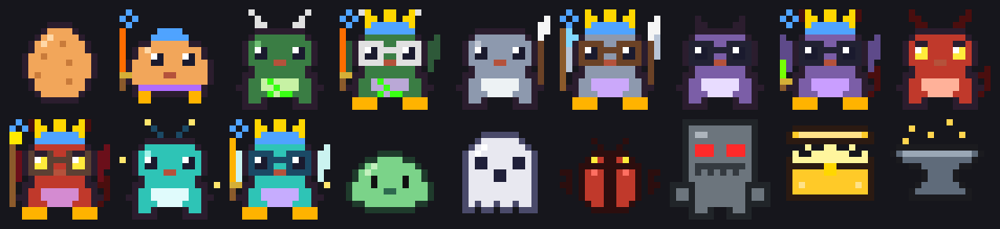
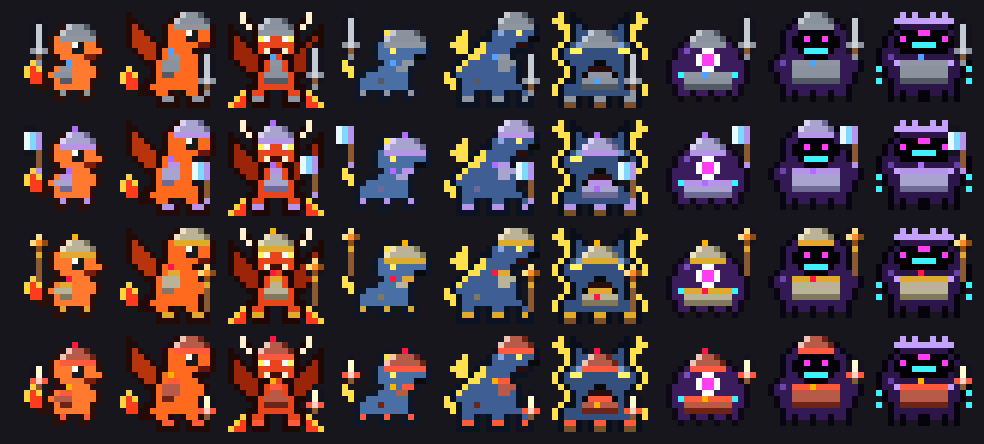

# claude-pet

An idle RPG pet that lives in your [Claude Code](https://claude.com/claude-code) statusline. While you code, monsters spawn, and your pet fights them, loots gear, shops, crafts and evolves. You never press a button; it plays itself.



*Top: the egg, the Fire, Lightning and Void starter lines, and the 1% Demon King with its Abyssal Scythe. Bottom: all 11 regular monsters, the loot crate and the crafting anvil. Rendered from the game's own sprite code. One more is out there, at 1 in 1000.*

## Install

Requires Node 18+, Claude Code, and a terminal with truecolor and Unicode block characters (Ghostty, iTerm2, WezTerm, Kitty, Alacritty, recent macOS Terminal).

```bash
git clone https://github.com/byQuexo/claude-pet.git ~/.claude-pet
node ~/.claude-pet/pet.js install
ln -s ~/.claude-pet/pet.js ~/.local/bin/pet   # optional, for `pet watch`
```

`install` backs up `settings.json`, then:
- adds async hooks for tool calls, tool failures, subagents, turn ends and session start
- replaces your statusline command with the pet wrapper, which runs your old one first, so it still shows above the pet

Open a new session and your egg appears after the first tool call. `node ~/.claude-pet/pet.js uninstall` puts everything back the way it was.

## Watching it

- **Statusline:** refreshes once a second, so the pet bobs, blinks and its effects pulse. Three modes (`pet mode`):
  - `full`: the 16×16 sprite plus a stats card with level, HP, XP, ATK/ARM/EVA, all 5 gear slots, gold, potions and buffs
  - `minimal`: only the pet, at the far right, beside your existing statusline
  - `compact`: two lines of text
- **`pet watch`:** the full animated view, framed in panels. Open it in a split next to Claude (e.g. Cmd+D in Ghostty).
  - **Arena:** replays every fight blow by blow: lunges, element-coloured slashes, crit shake, monsters dissolving when they die. It also shows crate openings, the crafting anvil and evolutions. Between fights the arena stays clear, with the last result and the town countdown.
  - **Gear:** a tile for each slot in its rarity colour (legendaries sparkle), with name, power score and top stat.
  - **Stats and active:** your stats on one side; buffs, tomes, set progress, unique effects and badges on the other.
  - **Log:** repeats collapse (`you committed ×3`) and purchases group.
  - **Keys:** `q` quit · `g` gear on/off · `r` replay the last fight.

## How it plays

- **Ticks:** every tool call is a tick. Monsters spawn on about 15% of ticks, and more often when a tool call fails.
- **Your starter is seeded by how you code:** while it's an egg (Lv 1–5), the pet records your tool mix, the hours you code, which file types you edit, how many repos you work in (hashed, never named), and your commits and test runs. At hatching all of that is hashed into a SHA-256 seed, which picks the species, the nature (a small stat lean) and a 1-in-128 shiny palette. `pet seed` shows what the egg has seen so far.
- **Three starter lines:** each evolves at Lv 5, 15 and 30.

  | Line | Forms | Signature skill |
  |---|---|---|
  | 🔥 Fire | Pyrobit → Blazewyrm → Infernus | Ember Breath: innate fire, burns |
  | ⚡ Lightning | Voltcub → Stormfang → Fenrir Thunderlord | Static Pounce: always strikes first, extra hits |
  | 🌑 Void | Glitchling → Nullwraith → Void Sovereign | Null Gaze: 20% chance to erase an enemy attack |
- **Class:** at Lv 15, whatever you do **more than you usually do** sets the pet's class, which tints its markings and gives a stat bonus. Bash → Shell, edits → Scribe, reads → Seeker, failures → Chaos, subagents → Hive.
- **The Demon King:** at the Lv 30 evolution (and again at Lv 40), a pet has a 1% chance to rise as the Monarch of Shadows instead. It wields the Abyssal Scythe, a demon-tier black scythe with a crimson edge that burns with shadow flame on every hit. Monsters it slays can rise again as shadow soldiers, up to 3, which strike at the start of every fight.
- **Loot:** 5 gear slots (weapon, armor, helmet, boots, charm) and 6 rarities: common, rare, epic, legendary, mythic (crafting only) and demon (the Demon King's scythe only).
  - Weapon types: sword, axe, dagger, staff.
  - Elements: 🔥 fire, ☠ poison, ❄ frost, ⚡ lightning.
  - Affixes such as lifesteal, thorns, regeneration, warding and shadows.
  - Every item has a power score (PWR), and drops are logged with ▲/▼ against what's equipped.
  - **Unique legendaries** (★): six one-of-a-kind items with a special effect that grow with your pet: Rubber Duck of Insight, Ctrl+Z Circlet (undoes a killing blow once per fight), Production Key, Infinite Loop Boots, Stack Overflow Plate and The Linter's Edge.
  - **Sets** (◆): On-Call (helmet, armor, boots: 3% HP back every round), Hacker (dagger, charm, boots: +30% crit damage) and Architect (staff, armor, helmet: a 25% HP shield every fight).
- **Gear is drawn on the pet:** each form has anchor points for its head, hand, chest, neck and feet. Weapons are held in the element's colour, helmets get a plume at epic and up, armor is a breastplate in the rarity's material (iron to obsidian), boots recolour the feet, and charms hang at the neck. `pet gear off` hides it.

  
- **A secret boss:** any fight has a 1-in-1000 chance of being something else entirely. It's tougher than any boss and can't be fled. Beat it once and you keep a 🏅 badge forever, next to your pet's name, plus +5% XP for good.
- **Combat:** armor reduces damage, and evasion rating gives a chance to dodge, with diminishing returns. Monsters have elemental weaknesses and resistances, and some poison, chill or burn your pet. The pet drinks potions when it's low, retreats from fights it's losing, and picks safer fights after a losing streak.
- **Town:** every 10 fights the pet fully heals, opens loot crates, crafts, sells leftovers and shops. The blacksmith reforges (+10% per level, up to +5) and ascends gear to the next rarity, and now and then a Legendary Merchant turns up with legendary or unique stock. It decides what to buy from its situation (low on potions, a boss due soon, an empty gear slot, which monsters keep showing up) and logs why.
- **Crafting:** the pet does this on its own.
  - Fuse 3 spare items of the same slot and rarity into the next rarity.
  - Infuse a weapon with an element its recent enemies are weak to.
  - Move affixes from spare gear onto equipped gear.
- **Your work shows up in the game:**
  - `git commit` blesses the pet.
  - `git push` pays a bounty in gold.
  - `gh pr create` awards a crate.
  - Passing tests give XP.
  - A failing test spawns a Failing Test Hydra.

## Commands

| | |
|---|---|
| `pet watch` | animated full view |
| `pet status` | print the statusline card once |
| `pet seed` | what the egg has observed so far, or the seed and what it decided |
| `pet mode full` / `minimal` / `compact` | full: sprite + stats card · minimal: only the pet, far right, beside your statusline · compact: 2 text lines |
| `pet gear` | gear panel: item icons, cards with power and set progress, and the bag with ▲/▼ comparisons |
| `pet gear on` / `off` | show or hide gear drawn on the pet (it stays equipped and listed in the card) |
| `pet width <n>` / `auto` | terminal width for minimal mode, if `$COLUMNS` is wrong |
| `pet install` / `uninstall` | wire into, or remove from, Claude Code settings |
| `pet sim <n> [bash\|edit\|read\|fail\|agent]` | fast-forward n ticks (this cheats your own save) |
| `pet reset` | release your pet and start over |

## System load

Measured on a Mac with Node 18:

| What | How often | Cost |
|---|---|---|
| Hook | once per tool call, async | ~30 ms, then exits |
| Statusline | every second | ~40 ms with the wrapped statusline cached; ~41 MB peak RAM, freed on exit |
| `pet watch` | only while open | ~0.6% CPU, ~45 MB RAM |

Nothing runs in the background unless `pet watch` is open. If the 1-second refresh is too much, set `"refreshInterval": 2` under `statusLine` in `~/.claude/settings.json`.

## Troubleshooting

- **The pet disappeared from the statusline:** another tool (for example a statusline plugin's setup command) rewrote `statusLine` in `settings.json`. Run `pet install` again; it wraps whatever statusline is there now.
- **Minimal mode is cut off at the right:** Claude Code gives the statusline a little less than the full terminal width. Run `pet width <n>` with a smaller number than your terminal's width, or `pet width auto` to go back.
- **Blocks look striped or shifted:** your terminal or font is missing truecolor or block characters. Try one of the terminals listed under Install.

## Privacy

Everything stays on your machine. The pet only reads hook payloads: the tool name, the Bash command (for the coding events), and while it's an egg, the file extension you edit and a hash of the working directory. Its save is a single JSON file in `~/.claude/claude-pet/`. It makes no network calls.

## License

MIT
