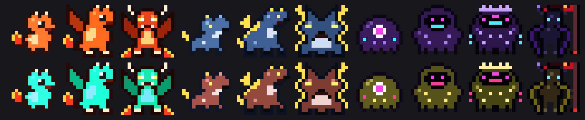

# idlemon wiki

Everything about your pet, its gear and the monsters it meets.

**Contents:** [How it plays](#how-it-plays) · [Your pet](#your-pet) · [Shiny pets](#shiny-pets) · [Natures](#natures) · [Classes](#classes) · [Stats](#stats) · [Elements](#elements) · [Monsters](#monsters) · [Loot](#loot) · [Items](#items) · [Uniques](#uniques) · [Sets](#sets) · [Consumables](#consumables) · [Crates](#crates) · [Town](#town) · [Crafting](#crafting) · [Coding events](#coding-events) · [The Demon King](#the-demon-king) · [The secret boss](#the-secret-boss) · [Levels](#levels)

## How it plays

Your pet plays on its own while you work. Monsters show up as you code, and more often right after something fails. Your pet fights them, collects loot and levels up.

- **Bosses** appear every 25 kills, once your pet is healthy enough to take one on.
- **Town:** every 10 fights your pet heads to town to heal, open crates, craft and go shopping.
- **Fainting:** a lost fight knocks your pet out for a short rest. It comes back at half health. Pets never die.
- **Playing it safe:** your pet drinks Energy Drinks when it's hurt, runs from fights it's about to lose, and picks easier fights after a losing streak.

## Your pet

Every pet starts as an egg. The egg quietly watches how you work, then hatches at Lv 5 into one of three species. That same moment decides its nature and whether it's shiny. Run `/idlemon seed` to see what yours got. It evolves again at Lv 15 and reaches its final form at Lv 30, which is noticeably stronger.

| Species | Forms (Lv 5 → 15 → 30) | Signature skill |
|---|---|---|
| 🐉 Fire | Pyrobit → Blazewyrm → Infernus | **Ember Breath:** every attack can set enemies on fire |
| 🐺 Lightning | Voltcub → Stormfang → Fenrir Thunderlord | **Static Pounce:** always strikes first and often hits twice |
| 👁 Void | Glitchling → Nullwraith → Void Sovereign | **Null Gaze:** 20% chance to erase an enemy attack |

## Shiny pets

One pet in **128** hatches shiny, with its colours shifted to a rare alternate palette. Shinies are purely cosmetic and show ✦ shiny next to their name.

*Top: normal. Bottom: shiny.*

## Natures

Every pet hatches with one of 8 natures, a small permanent edge.

| Nature | Effect |
|---|---|
| Bold | +5% ATK |
| Restless | +8% SPD |
| Calm | +6% armor |
| Reckless | +8% ATK, −5% armor |
| Patient | heals a little faster |
| Curious | +2% crit |
| Stubborn | +6% max HP |
| Sly | +15% evasion |

## Classes

At Lv 15 your pet picks up a class based on what you've been doing more of than usual. The class tints its markings and gives a bonus.

| Class | Earned by | Bonus |
|---|---|---|
| Shell | running commands | +25% ATK |
| Scribe | editing files | +40% armor, +15% HP |
| Seeker | reading and searching | +15% crit |
| Chaos | things going wrong | +35% ATK, +8% crit, −20% armor |
| Hive | using subagents | +25% multi-hit, +30% SPD |

## Stats

| Stat | What it does |
|---|---|
| HP | how much damage your pet can take |
| ATK | how hard it hits |
| Armor | reduces every hit it takes |
| EVA | chance to dodge an attack completely; harder against stronger monsters, max 60% |
| SPD | the faster side strikes first |
| CRIT | chance to deal double damage, max 75% |
| LIFE | heals your pet for part of the damage it deals, max 30% |
| THRN | reflects part of the damage it takes back at the attacker, max 50% |
| RES | protects against burn, poison and chill, max 75% |
| MULTI | chance to attack twice |
| REGEN | extra healing between fights |

Base stats before gear:

| Level | HP | ATK | Armor | SPD |
|---|---|---|---|---|
| 1 | 40 | 6 | 2 | 5 |
| 10 | 130 | 26 | 12 | 10 |
| 20 | 230 | 48 | 23 | 15 |
| 30 | 330 | 70 | 34 | 20 |
| 40 | 430 | 92 | 45 | 25 |

## Elements

Weapons can carry an element. Hitting a monster's weakness deals 1.5× damage, and hitting its resistance only 0.6×.

| Element | Effect |
|---|---|
| 🔥 Fire | often sets the enemy burning for a few rounds |
| ☠ Poison | stacks up to 5 times, hurting every round |
| ❄ Frost | can freeze the enemy so it loses a turn |
| ⚡ Lightning | can chain into a second hit |
| 🌑 Shadow | every hit burns, and nothing resists it (Demon King only) |

## Monsters

The numbers compare each monster to an average one at the same level.

| Monster | Also called | HP | ATK | Armor | SPD | Weak to | Resists | Can inflict | Shows up while |
|---|---|---|---|---|---|---|---|---|---|
| **Merge Conflict Slime** | Spaghetti Ooze, Memory Leak Blob | ×1.1 | ×0.9 | ×0.8 | ×0.8 | 🔥 fire | ☠ poison | — | running commands, editing files, reading and searching, using subagents |
| **Null Pointer Wraith** | Heisenbug Phantom, Zombie Process | ×0.85 | ×1.15 | ×0.6 | ×1.2 | ⚡ lightning | ❄ frost | ❄ frost | running commands, editing files, reading and searching, things going wrong, using subagents |
| **Off-By-One Beetle** | Race Condition Roach, Flaky Test Mite | ×0.9 | ×1 | ×1.3 | ×1 | ☠ poison | 🔥 fire | ☠ poison | running commands, editing files, reading and searching, things going wrong, using subagents |
| **Legacy Monolith** | Tech Debt Colossus, 3AM Prod Incident | ×1 | ×1 | ×1.2 | ×0.7 | — | everything | 🔥 fire | boss fights |
| **Infinite Loop Ouroboros** | Recursion Serpent, While(true) Wyrm | ×1.3 | ×0.85 | ×0.9 | ×0.9 | ❄ frost | 🔥 fire | ☠ poison | running commands, using subagents |
| **Cron Bat** | Midnight Job Bat, Scheduled Screecher | ×0.8 | ×1.05 | ×0.6 | ×1.4 | ⚡ lightning | ☠ poison | — | reading and searching, using subagents |
| **Segfault Skeleton** | Core Dump Revenant, Dangling Pointer Bones | ×0.9 | ×1.15 | ×1 | ×1 | 🔥 fire | ❄ frost | ❄ frost | editing files, things going wrong, using subagents |
| **Timeout Turtle** | 504 Tortoise, Blocking I/O Turtle | ×1.4 | ×0.8 | ×1.8 | ×0.5 | ⚡ lightning | ☠ poison | — | running commands, things going wrong |
| **Phishing Mimic** | Fake Login Chest, Too-Good-To-Be-True Crate | ×1.1 | ×1.25 | ×1 | ×1.1 | 🔥 fire | ❄ frost | ☠ poison | elite fights |
| **Dependency Hydra** | node_modules Hydra, Transitive Dependency Beast | ×1.5 | ×1.1 | ×1.1 | ×0.9 | ☠ poison | 🔥 fire | ☠ poison | elite fights |
| **Kubernetes Kraken** | Helm Chart Horror, CrashLoopBackOff Leviathan | ×1.1 | ×1 | ×1.1 | ×0.8 | ⚡ lightning | ❄ frost | ❄ frost | boss fights |

- **Elites** are tougher versions that show up about one fight in ten. They drop better loot. Some are Phishing Mimics, which drop a real crate when beaten.
- **Bosses** are a level above your pet and much tougher, but always drop 2 pieces of gear, a crate and a consumable.
- **Failing Test Hydra:** when a test run fails, one of these ambushes your pet straight away.

## Loot

| After a win | Normal | Elite | Boss |
|---|---|---|---|
| Gear | 55% chance | 80% chance | 2 pieces |
| Rarity odds (common / rare / epic / legendary) | 58 / 29 / 10 / 3 | 25 / 45 / 23 / 7 | 0 / 35 / 45 / 20 |
| Consumable | 25% | 25% | always |
| Crate | 10% | 40% | always |
| XP and gold | normal | ×2 | ×5 |

- **Uniques:** about 4% of legendary drops are a unique instead, and bosses have an extra small chance.
- **Sets:** a third of epic-or-better drops can turn out to be set pieces.
- **Elements:** rarer weapons are more likely to carry one, and every legendary does.
- **Affixes:** rare and better items can roll a magic affix; legendaries get two.
- **Auto-equip:** your pet puts on anything that beats what it's wearing. It favours uniques and pieces that complete a set.

## Items

| Rarity | Strength | Looks like | Where it comes from |
|---|---|---|---|
| common | ×1 | Rusty, Dusty, Legacy, Deprecated | drops |
| rare | ×1.6 | Polished, Typed, Linted, Tested | drops, shop |
| epic | ×2.4 | Arcane, Async, Immutable, Memoized | drops, shop, fusion |
| legendary | ×3.5 | Mythic, Zero-Day, Quantum, Senior | drops, shop, Legendary Merchant, fusion, ascension |
| mythic | ×5 | Ascended, Eternal, Primordial, Root-Access | only fusing 3 legendaries or ascending one |
| demon | ×6 | Abyssal | the Demon King's Abyssal Scythe only |

**Gear slots** (example stats):

| Slot | Gives | Rare, Lv 10 | Legendary, Lv 30 | Kinds |
|---|---|---|---|---|
| weapon | ATK | +13.6 ATK | +78.8 ATK | sword, axe, dagger, staff |
| armor | armor, HP | +8.8 armor, +38 HP | +50.8 armor, +224 HP | Cache Cloak, Firewall Plate, Mutex Mail, Kubernetes Chainmail, Type-Safe Vest |
| helmet | armor, HP | +4.8 armor, +29 HP | +28 armor, +168 HP | Code Review Helm, Hard Hat of Prod, Thinking Cap, Noise-Cancelling Helm |
| boots | SPD, armor, evasion | +2.6 SPD, +2.9 armor, +16 evasion rating | +14 SPD, +16.8 armor, +91 evasion rating | Sprint Boots, Async Sneakers, Rollback Greaves, CI Runners |
| charm | crit, SPD, evasion | +2% crit, +1.8 SPD, +8 evasion rating | +5% crit, +9.5 SPD, +45.5 evasion rating | Rubber Duck, Coffee Flask, Lucky Commit, Green CI Badge, Sudo Ring |

**Weapon types:**

| Type | Style | Names |
|---|---|---|
| sword | balanced | Regex Blade, Merge Sword, Hotfix Saber, Branch Cutter |
| axe | +35% ATK, a little slower | Refactor Axe, Tech Debt Cleaver, Monolith Splitter |
| dagger | less ATK, more crit | Semicolon Dagger, Null Shiv, Off-By-One Knife |
| staff | less ATK, heals on hit | Debugger Staff, Stack Trace Wand, Linter Rod |

**Affixes:**

| Affix | Adds |
|---|---|
| of Haste | SPD |
| of the Vampire | lifesteal |
| of Vigor | max HP |
| of Precision | crit |
| of Thorns | thorns |
| of Regeneration | regen |
| of Warding | resist |
| of Shadows | evasion |

**PWR** is one number for how strong an item is overall. Drops show ▲/▼ against what your pet is wearing.

## Uniques

Six one-of-a-kind legendaries, each with a special power. You can only own each one once, your pet never sells them, and they grow stronger as your pet levels up.

| Unique | Slot | Power |
|---|---|---|
| ★ Rubber Duck of Insight | charm | weakness hits deal 2× instead of 1.5× |
| ★ Ctrl+Z Circlet | helmet | once per fight, undoes a killing blow |
| ★ Production Key | dagger | double gold, but monsters hit 10% harder |
| ★ Infinite Loop Boots | boots | +15% chance to strike twice |
| ★ Stack Overflow Plate | armor | reflects 30% of damage taken |
| ★ The Linter's Edge | sword | crits deal 2.5× instead of 2× |

They come from rare legendary drops, bosses, Mythic Chests and the Legendary Merchant.

## Sets

Wear all 3 pieces of a set for its bonus.

| Set | Pieces | Bonus |
|---|---|---|
| ◆ On-Call | helmet, armor, boots | 3% HP back every round |
| ◆ Hacker | dagger, charm, boots | +30% crit damage |
| ◆ Architect | staff, armor, helmet | a 25% HP shield at the start of every fight |

## Consumables

A won fight sometimes drops a consumable. Bosses always do.

| Consumable | Odds | Effect |
|---|---|---|
| Energy Drink | 43% | heals 60% when your pet is hurt; it carries up to 5 |
| Buff | 30% | a boost for the next 5–8 fights |
| Tome | 15% | a small permanent stat boost |
| Stack Overflow Scroll | 12% | a bit of XP |

**Buffs:**

| Buff | Effect |
|---|---|
| 🔥 Hotfix Rage | +50% ATK |
| 🛡 Firewall | +60% armor |
| ⚡ Overclock | +50% SPD and extra hits |
| 🎯 Deep Focus | +20% crit |
| ✨ Commit Blessing | +15% ATK and armor, from making a git commit |
| 💨 Smoke Bomb | much harder to hit |

**Tomes:** Clean Code Tome (ATK), Design Patterns Tome (armor), Pragmatic Programmer Tome (HP), Caffeine Tome (SPD), Hacker's Tome (crit), Parkour Tome (evasion rating).

## Crates

Crates are opened on the next town visit.

| Crate | Contains | Best odds |
|---|---|---|
| Wooden Crate | 1 item, gold | mostly common |
| Iron Crate | 2 items, gold, 1 consumable | mostly rare |
| Golden Crate | 3 items, gold, 1 consumable | epic and legendary |
| Mythic Chest | 3 items, gold, 2 consumables, a tome and a free level | epic and legendary only, sometimes a unique |

You get crates from fights, the shop, Phishing Mimics, and by opening a pull request.

## Town

Every 10 fights your pet goes to town on its own. It heals fully, opens its crates, crafts, sells gear it doesn't need and goes shopping. The log tells you why it bought each thing.

| Shop | What your pet uses it for |
|---|---|
| Gear | upgrades for any slot (always at least one elemental weapon) |
| Energy Drinks | restocking when it's running low |
| Buffs | before a boss or after a rough patch |
| Tomes | when it has plenty of gold |
| Crates | to fill empty slots, or for fun when rich |
| Blacksmith: reforge (up to +5) | +10% to every stat on a piece it's wearing |
| Blacksmith: ascend | raises a piece it's wearing to the next rarity, up to mythic |
| Legendary Merchant | shows up now and then with legendary gear, sometimes a unique |

## Crafting

Your pet crafts by itself in town, for a small fee.

| Recipe | What it does |
|---|---|
| Fusion | 3 spare items of the same slot and rarity become one item of the next rarity |
| Infusion | moves an element from a spare weapon onto the one it's wearing |
| Enchanting | moves an affix from a spare item onto one it's wearing |

## Coding events

| When you… | Your pet… |
|---|---|
| commit | gets a ✨ Commit Blessing: +15% ATK and armor for a few fights |
| push | earns a gold bounty |
| open a pull request | receives an Iron Crate |
| run tests that pass | gains some XP |
| run tests that fail | gets ambushed by a Failing Test Hydra |

## The Demon King

When a pet reaches its final form there's a 1% chance it rises as the Demon King, Monarch of Shadows, instead. Pets that miss get one more chance at Lv 40.

- **Abyssal Scythe:** a demon-tier scythe only the Demon King can hold. Enormous attack, 15% lifesteal, and every hit burns with shadow flame. It grows with the pet.
- **Arise:** each monster it defeats has a 10% chance to rise as a shadow soldier, up to 3. Every soldier strikes at the start of each fight.

## The secret boss

Somewhere out there is a boss that turns up in about 1 fight in 1000. He's much tougher than any regular boss and you can't run from him. Beat him once and your pet wears the 🏅 The Secret Boss Slayer badge forever, earns 5% more XP, and gets a Mythic Chest.

## Levels

Levels take longer as your pet grows.

| Level | XP needed | Level | XP needed |
|---|---|---|---|
| 1 | 25 | 30 | 18981 |
| 5 | 577 | 35 | 25637 |
| 10 | 2228 | 40 | 33263 |
| 15 | 4913 | 50 | 51396 |
| 20 | 8609 | 60 | 73339 |
| 25 | 13302 | 75 | 113321 |

---
*Numbers on this page come from the game code. Run `node tools/wiki.js` to rebuild it after a balance change.*
